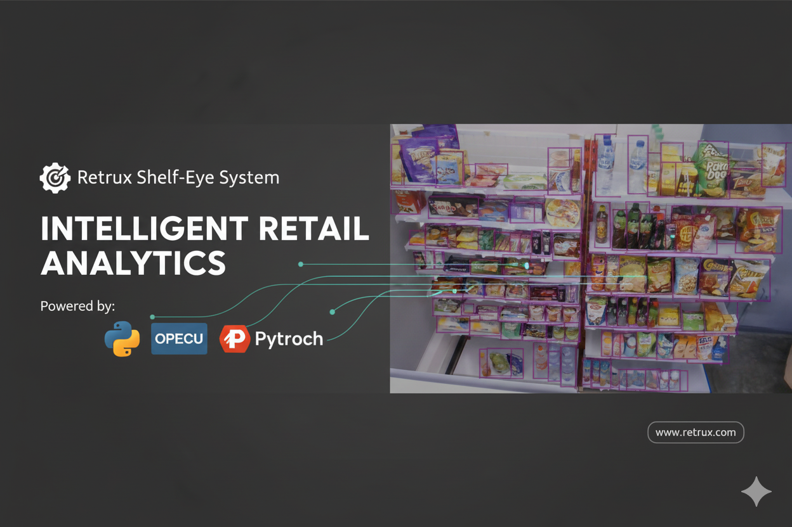
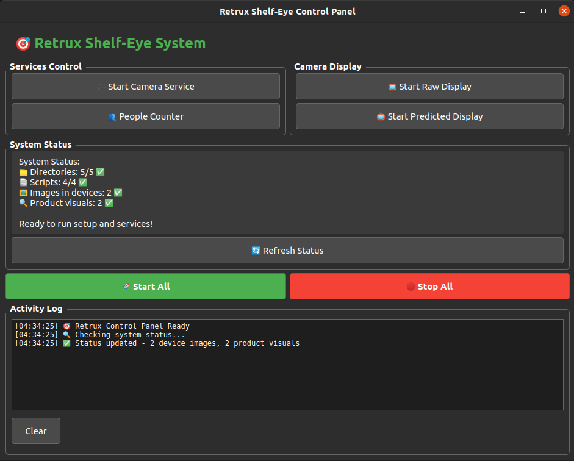

<div align="center">
<h1>🎯 RETRUX SHELF-EYE SYSTEM - INTELLIGENT RETAIL MONITORING</h1>

<p align="center">
<a target="blank" href="https://www.python.org/">

</a>
<a target="_blank" href="https://pytorch.org/">

</a>
<a target="blank" href="https://opencv.org/">

</a>
</a>
    
</a>
<br><br>
</p>
</div>

<p align="center">
<a target="_blank" href="#"></a>
<a target="_blank" href="#"></a>
<a target="_blank" href="#"></a>
</p>

<p align="center">
<a href="#-introduction">Introduction</a> &nbsp;&bull;&nbsp;
<a href="#-tech-stack">Tech Stack</a> &nbsp;&bull;&nbsp;
<a href="#-preview">Preview</a> &nbsp;&bull;&nbsp;
<a href="#-installation--usage">Installation & Usage</a> &nbsp;&bull;&nbsp;
<a href="#-ai-models">AI Models</a> &nbsp;&bull;&nbsp;
<a href="#-system-components">System Components</a> &nbsp;&bull;&nbsp;
<a href="#-issue">Issue</a>&nbsp;&bull;&nbsp;
<a href="#-license">License</a>&nbsp;&bull;&nbsp;
<a href="#-author">Author</a>
</p>

---

## 📄 Introduction

This project is an **AI-powered retail monitoring and analytics platform** designed to solve the complex problem of real-time shelf inventory management and customer analytics. The application combines multiple computer vision algorithms with **real-time monitoring and visualization** to provide comprehensive retail intelligence solutions.

### 🎯 Key Features
- **Multi-Camera Support**: Automatic camera detection with continuous background operation
- **Product Detection**: AI-powered shelf inventory monitoring using OliwoModel (DETR)
- **People Counting**: YOLO-based customer detection and tracking in video files
- **Real-time Visualization**: Interactive displays with bounding boxes and detection results
- **State Tracking**: Difference detection between reference and current shelf states
- **Batch Processing**: Support for multiple video files with progress tracking
- **Centralized Control**: Main launcher for managing all system components
- **JSON Storage**: Structured product information and detection results
- **Grid Display**: Multi-camera view with timestamp overlays
- **Enhanced Monitoring**: Side-by-side comparison interface for analysis

This project demonstrates advanced **computer vision** techniques combined with modern Python technologies for solving real-world retail monitoring and analytics problems.

---

## 💻 Tech Stack

Frameworks, Libraries, and Tools used in this project:

<p align="center">
<a target="_blank" href="https://www.python.org/">

</a>
<a target="_blank" href="https://pytorch.org/">

</a>
<a target="_blank" href="https://opencv.org/">

</a>
<a target="_blank" href="https://docs.ultralytics.com/">

</a>
</p>

<p align="center">
<a target="_blank" href="https://huggingface.co/">

</a>
<a target="_blank" href="https://www.tkinter.org/">

</a>
<a target="_blank" href="https://pillow.readthedocs.io/">

</a>
</p>

---

## 🖼️ Preview

<div align="center">

</div>

### 📊 Application Features
- **Main Control Panel**: Centralized launcher for all system components with status monitoring
- **Multi-Camera Display**: Grid-based layout showing multiple camera feeds with timestamps
- **AI Detection Results**: Real-time visualization with bounding boxes and confidence scores
- **Enhanced Dual Display**: Side-by-side comparison between raw feed and AI detection results

### 🎯 Monitoring Capabilities
- **Product Scanner**: Real-time shelf inventory tracking with state comparison
- **People Counter**: Customer traffic analysis with batch video processing
- **Difference Detection**: Automatic identification of shelf state changes
- **Visual Analytics**: Color-coded results and detection labels

### 📈 Performance Metrics
- **Detection Accuracy**: High-precision product and people detection
- **Real-time Processing**: Frame-by-frame analysis with minimal latency
- **Multi-camera Support**: Handles multiple camera feeds simultaneously
- **Scalability**: Processes video files and live camera feeds efficiently

---

## ⚙️ Installation & Usage

### 📋 Prerequisites
- Python 3.11 or higher
- Virtual environment (recommended)
- Webcam/camera (optional, for live capture)
- GPU with CUDA support (optional, for faster processing)
- Git (optional, for repository cloning)

### 🔧 Step-by-Step Installation

#### 1. Clone Repository
```bash
# Clone the repository
git clone <repository-url>
cd retrux-shelf-eye
```

#### 2. Create Virtual Environment
```bash
# Create virtual environment
python -m venv venv

# Activate virtual environment
source venv/bin/activate  # Linux/macOS
# venv\Scripts\activate    # Windows
```

#### 3. Install Dependencies
```bash
# Install all required packages
pip install -r requirements.txt

# YOLO models will be automatically downloaded on first run
```

#### 4. Setup Directory Structure
```bash
# The system will automatically create required directories
# Optionally, prepare sample images manually:
mkdir -p retruxosaproject/app_root/active_state/devices

# Copy your camera images (.jpg) to the devices folder
# cp your_images/*.jpg retruxosaproject/app_root/active_state/devices/
```

### 🚀 Usage

#### Method 1: Using Main Launcher (Recommended)
```bash
# Start the main control panel
python main_launcher.py
```

**First-time setup workflow:**
1. Click **"🔄 Refresh Status"** to check system status
2. Add sample images to `devices/` folder
3. Click **"⚙️ Run Setup"** to initialize AI detection
4. Click **"🚀 Start All"** to begin monitoring all services

#### Method 2: Individual Components
```bash
# Camera Service - Background camera capture
python cam_service/camera_service_ui.py

# Camera Display - View camera feeds
python cam_display/camera_display_ui.py

# People Counter - Customer analytics
python people_counter/people_counter_ui.py

# Product Scanner - Shelf monitoring
python product_scan/product_scanner_ui.py
```

### 📁 Project Structure
```
retrux-shelf-eye/
├── main_launcher.py                 # Main control panel
├── requirements.txt                 # Python dependencies
├── README.md                        # This documentation
├── cam_service/                     # Camera capture system
│   ├── camera_server.py            # Camera capture service
│   ├── camera_service_ui.py        # Camera service GUI
│   ├── scanner.py                  # Camera detection utility
│   └── background_service.py       # Background camera handler
├── cam_display/                     # Display systems
│   ├── display_camera.py           # Basic camera display
│   ├── camera_display_ui.py        # Camera display GUI
│   ├── camera_display_enhanced.py  # Enhanced dual display
│   └── grid_display.py            # Grid layout utilities
├── people_counter/                  # People counting module
│   ├── count.py                    # YOLO people detection
│   ├── count-people.zsh           # Shell wrapper
│   ├── people_counter_ui.py        # People counter GUI
│   └── *.mp4                       # Video files for processing
├── product_scan/                    # Product detection module
│   ├── shelf_scan_fixed.py        # Main scanner logic
│   ├── shelf_scanner.zsh          # Shell wrapper
│   ├── product_scanner_ui.py      # Product scanner GUI
│   └── oliwo_weights/             # AI model weights
│       ├── xoliwo.py              # OliwoModel implementation
│       └── xcodiff.py             # Image difference detection
└── retruxosaproject/               # Data storage
    └── app_root/
        ├── active_state/
        │   ├── devices/           # Input camera images
        │   └── product_visual/    # AI detection output
        ├── last_state/            # Reference images
        ├── product_information/   # Product detection JSON
        └── product_state/         # Inventory state tracking
```

### 🔄 Typical Workflow

#### 1. Initial Setup (One-time)
```bash
# Step 1: Place images in devices folder
cp your_images/*.jpg retruxosaproject/app_root/active_state/devices/

# Step 2: Run main launcher
python main_launcher.py

# Step 3: Click "⚙️ Run Setup" button
# Wait for AI model initialization to complete
```

#### 2. Daily Operation
```bash
# Start main launcher
python main_launcher.py

# Click "🚀 Start All" to launch:
# - Camera Service (background capture)
# - Raw Camera Display
# - AI Detection Display
# - Enhanced Dual Display

# Monitor displays in real-time
# Review detection results and analytics
```

#### 3. People Counting Workflow
```bash
# Step 1: Add video files to people_counter/ directory
cp your_videos/*.mp4 people_counter/

# Step 2: Open People Counter GUI
python people_counter/people_counter_ui.py

# Step 3: Select video file from dropdown
# Step 4: Click "Run Analysis"
# Step 5: Review results and statistics
```

#### 4. Product Scanning Workflow
```bash
# Automatic operation with main launcher
# Or manual operation:
python product_scan/product_scanner_ui.py

# Click "Start Scanning" for real-time monitoring
# Click "Test Prediction" for single image analysis
# Review product_information/ for detection results
```

### 🎨 Display Options

#### Raw Camera Display
- Shows original images from `devices/` folder
- Grid layout with automatic timestamp overlay
- Real-time updates when new images are added
- Multi-camera support with synchronized display

#### AI Detection Display  
- Shows processed images from `product_visual/` folder
- Includes bounding boxes and detection labels
- Color-coded results with confidence scores
- Real-time product detection visualization

#### Enhanced Dual Display
- **3 tabs**: Raw Feed, AI Results, Side-by-Side comparison
- **Real-time comparison** between input and processed output
- **Synchronized updates** across all display modes
- **Interactive navigation** between different views

---

## 🧠 AI Models

### 🎯 Available Models

#### 1. **OliwoModel (Product Detection)**
- **Type**: DETR (Detection Transformer)
- **Framework**: HuggingFace Transformers
- **Classes**: Product detection with bounding boxes
- **Input**: JPG/PNG images (RGB format)
- **Output**: JSON with coordinates, labels, and confidence scores
- **Performance**: Real-time detection on CPU/GPU
- **Use Case**: Shelf inventory monitoring and product tracking

#### 2. **YOLO (People Detection)**
- **Type**: YOLOv11n (nano variant)
- **Framework**: Ultralytics YOLO
- **Classes**: Person detection and tracking
- **Input**: Video files (MP4, AVI, MOV, etc.)
- **Output**: People count with timestamps and confidence
- **Performance**: Fast inference for real-time applications
- **Auto-download**: Model weights downloaded automatically on first run
- **Use Case**: Customer traffic analysis and footfall counting

#### 3. **Image Difference Detection**
- **Type**: Computer Vision algorithm
- **Method**: Pixel-wise comparison with thresholding
- **Input**: Reference image vs Current image
- **Output**: Difference visualization with change detection
- **Performance**: Fast CPU-based processing
- **Use Case**: Shelf state monitoring and change detection

### 🔧 Model Configuration
```python
# OliwoModel configuration
{
    "model": "facebook/detr-resnet-50",
    "confidence_threshold": 0.7,
    "device": "cuda",  # or "cpu"
    "output_format": "json"
}

# YOLO configuration
{
    "model": "yolo11n.pt",
    "confidence": 0.25,
    "iou_threshold": 0.45,
    "classes": [0],  # person class only
    "device": "0"    # GPU device ID or "cpu"
}
```

---

## 🚩 System Components

### 📹 Camera System
- **Multi-camera support** with automatic detection
- **Real-time frame capture** and processing
- **Background service** for continuous operation
- **Grid-based display** with timestamp overlay
- **Automatic device scanning** and initialization

### 🔍 Product Scanner
- **AI-powered product detection** using OliwoModel
- **Shelf inventory monitoring** with state tracking
- **Difference detection** between reference and current images
- **Real-time visual output** with bounding boxes
- **JSON-based product information** storage
- **State management** for inventory changes

### 👥 People Counter
- **YOLO-based people detection** in video files
- **Batch processing** support for multiple videos
- **Progress tracking** with real-time updates
- **Results history** and statistics
- **Confidence scoring** for detection accuracy
- **Video file format support**: MP4, AVI, MOV

### 📊 Display Systems
- **Raw camera feed** display with grid layout
- **AI detection results** visualization
- **Side-by-side comparison** view
- **Enhanced dual monitoring** interface
- **Synchronized updates** across displays
- **Interactive controls** for display settings

---

## 🚩 Issue

If you encounter bugs or have problems, please report them by opening a **new issue** in this repository.

### 📋 Issue Template
When reporting issues, please include:
- Problem description and expected behavior
- Steps to reproduce the issue
- Environment details (OS, Python version, GPU/CPU)
- AI model used and configuration parameters
- Error logs and screenshots
- Camera/video specifications
- Input image/video samples (if applicable)

### 🔍 Common Issues and Solutions

#### Camera Issues:
- **Camera not detected**: Check camera permissions and USB connections
- **No frames captured**: Verify camera index and device availability
- **Low frame rate**: Reduce resolution or use hardware acceleration
- **Permission denied**: Run with appropriate user permissions

#### AI Model Issues:
- **Model not found**: Ensure weights are downloaded correctly
- **CUDA out of memory**: Reduce batch size or switch to CPU
- **Low detection accuracy**: Adjust confidence threshold or retrain model
- **Slow inference**: Use GPU acceleration or lighter model variant

#### Display Issues:
- **Images not loading**: Check file paths and image format
- **GUI not responding**: Update Tkinter or use different Python version
- **Memory errors**: Reduce image resolution or display grid size
- **Bounding boxes not visible**: Adjust line width and color settings

#### People Counter Issues:
- **Video not processing**: Verify video codec and format compatibility
- **Incorrect counts**: Adjust confidence threshold and IOU settings
- **Processing timeout**: Reduce video resolution or split into segments
- **YOLO download failed**: Check internet connection and try manual download

#### Product Scanner Issues:
- **No products detected**: Check image quality and lighting conditions
- **False positives**: Increase confidence threshold
- **State tracking errors**: Reset reference images in `last_state/` folder
- **JSON parsing errors**: Validate output format and file permissions

---

## 📝 License

This project is licensed under the **MIT License** - see the [LICENSE](LICENSE) file for details.

---

## 📌 Author

<div align="center">
<h3>🧑‍💻 Syahrul Fathoni Ahmad</h3>
<p><em>Frontend Developer | UI/UX Designer | System Architecture Specialist</em></p>

### 👨‍💻 Role & Responsibilities:
- **User Interface Design**: Created intuitive and responsive GUI using Tkinter
- **Software Architecture**: Designed modular system structure and component integration
- **Frontend Development**: Implemented all display systems and user interfaces
- **System Integration**: Connected AI models with user-friendly interfaces
- **User Experience**: Optimized workflow and interaction design for retail monitoring

### 🤝 Team Collaboration:
- **AI Development**: Computer vision models and algorithms developed by team members
- **Model Integration**: Seamlessly integrated OliwoModel and YOLO detection systems
- **Testing & Optimization**: Collaborated on performance tuning and accuracy improvements

<p>
<a target="_blank" href="https://www.linkedin.com/in/syahrulahmad/">

</a>
<a target="_blank" href="https://github.com/still-breath">

</a>
<a target="_blank" href="https://syahrul-fathoni.verce.app">

</a>
</p>
</div>

---

<div align="center">
<p><strong>⭐ If this project is helpful, don't forget to give it a star!</strong></p>
<p><em>Created with ❤️ for advancing retail intelligence and computer vision technology</em></p>
</div>